# Smart Library Management System
 

This project is an attempt to make the mass issue and return procedure of books faster, efficient and less cumbersome. 
 
Prerequisite Requirements:
- jdk (version 15 or above)
- jre (version 15 or above)
- Netbeans (version 12 or above) (OPTIONAL - for contributors)
 
Steps to use the software:
<ol>
<li> Clone the repository </li>
<li> Execute dist/LMS.jar </li>
<li> Open project with Netbeans to modify<li>
<ol>

<H3> <u>Glimpses of the UI</u></H3>
<H4><u>Welcome GUI</u> :</H4> 
<b>Loading Page<b> 
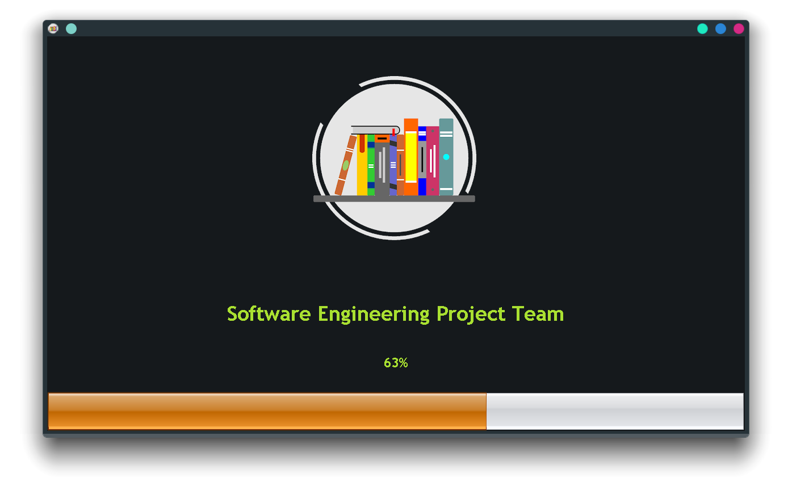 
<b>Welcome Screen</b> 
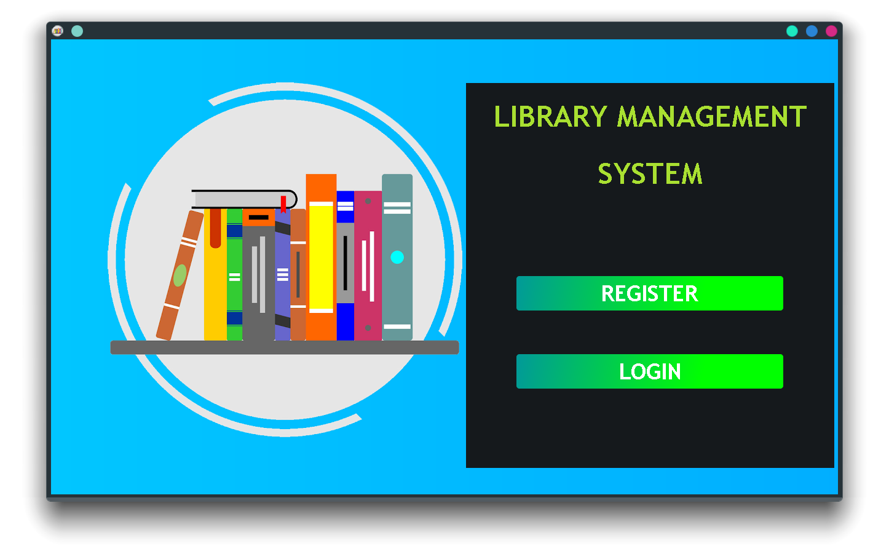 
<b>Register Page</b> 
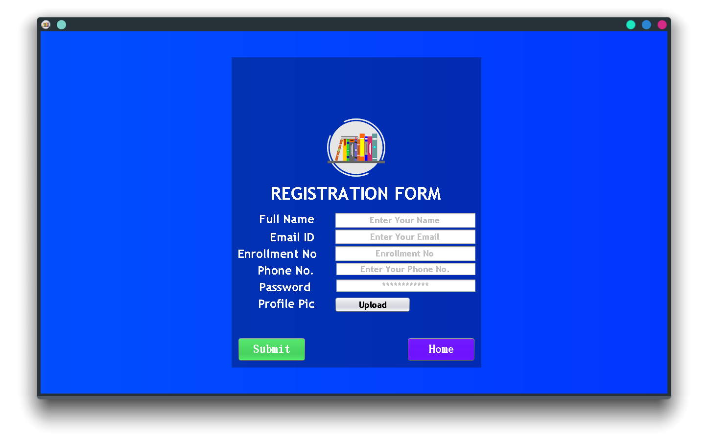 
<b>Login Page<b> 
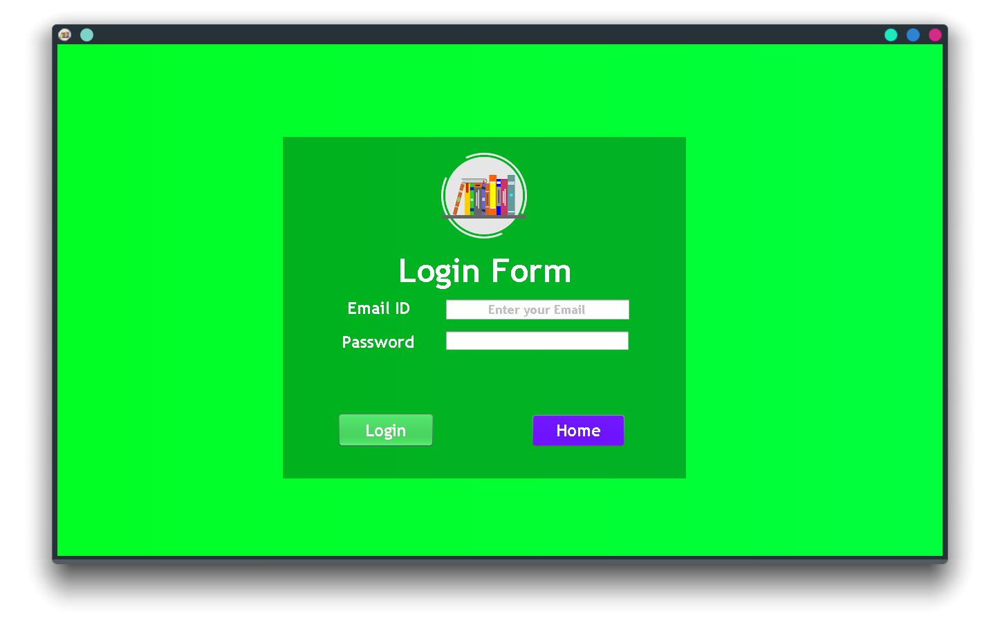 
 
<H4><u>Librarian GUI</u> :</H4> 
<b>Profile Page</b> 
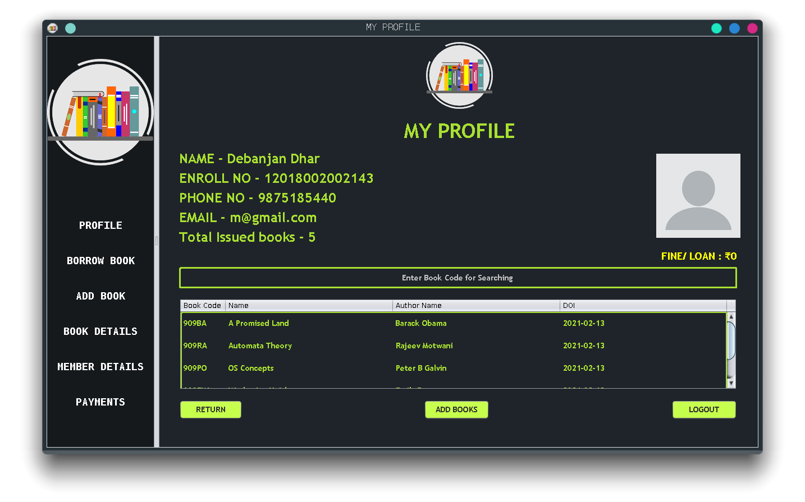 
<b>Borrow Book Page</b> 
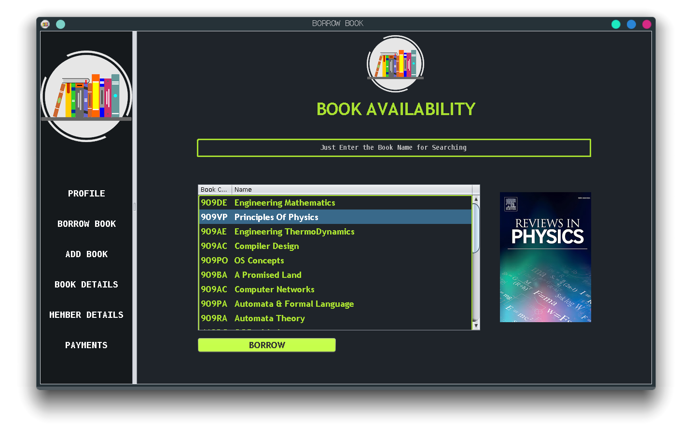 
<b>Add Book Page</b> 
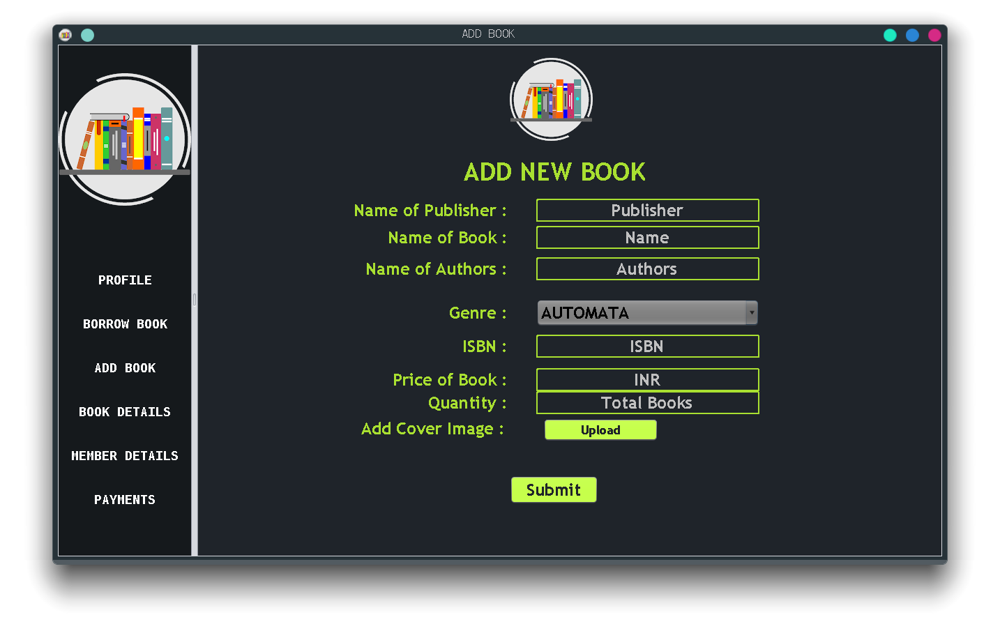 
<b>Book Details Page</b>  
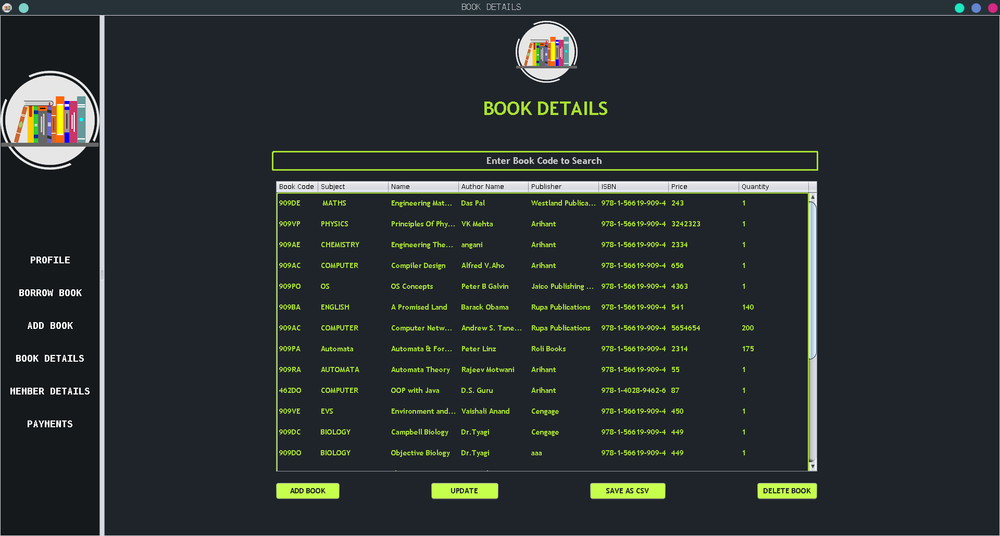 
<b>Member Details Page</b>  
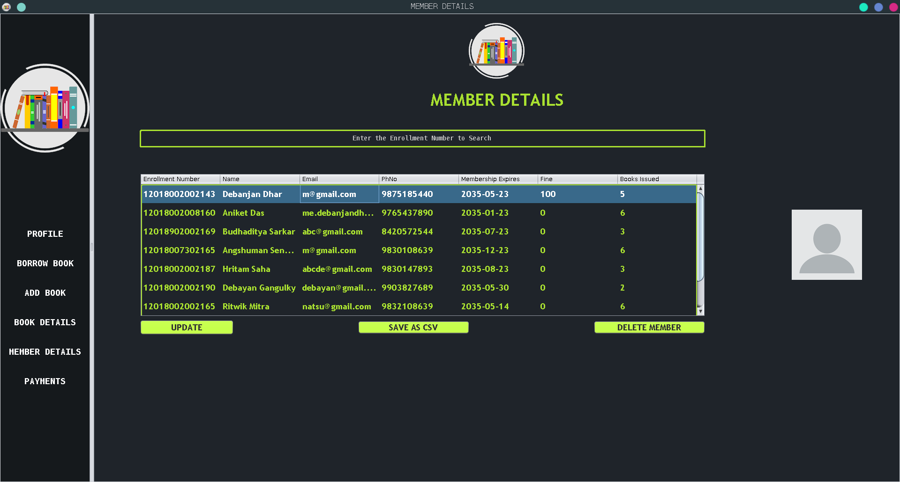 
<b>Payment Details Page</b>  
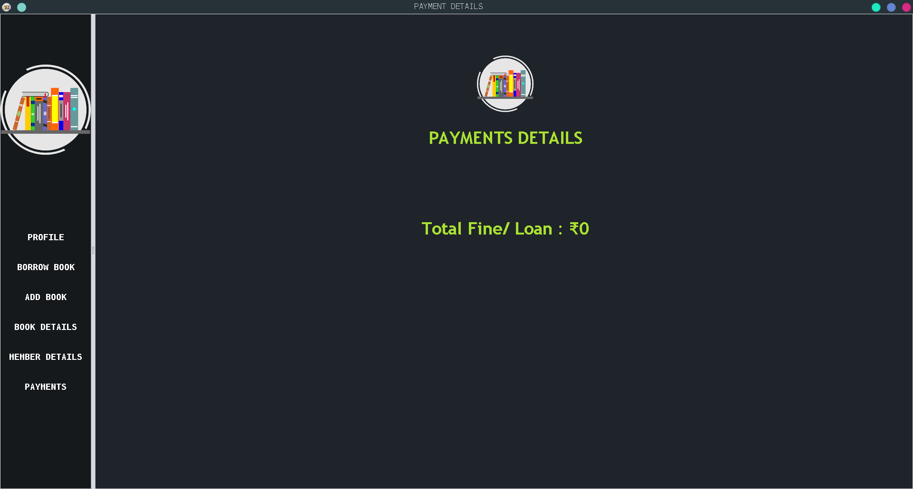 

<H4><u>Member GUI</u> :</H4> 
<b>Profile Page</b> 
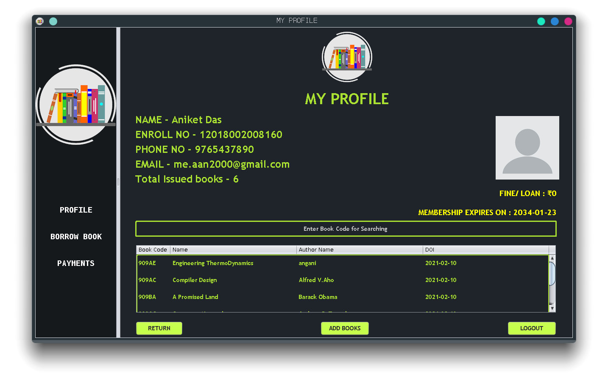 
<b>Borrow Book Page</b> 
 
<b>Payment Details Page</b>  
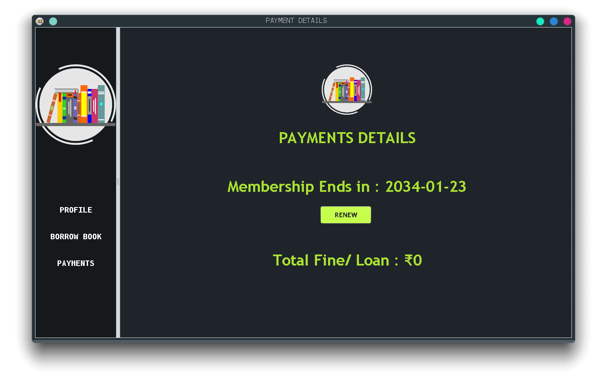 

  
<b>Contributions are welcome</b> 
To contribute :
- Fork the project
- Clone repository with  `git clone <REPO_LINK>`
- Create a new branch with the name of the feature added/bug removed (Example: `git checkout -b <BRANCH_NAME>`)
- Commit changes and make a PR
